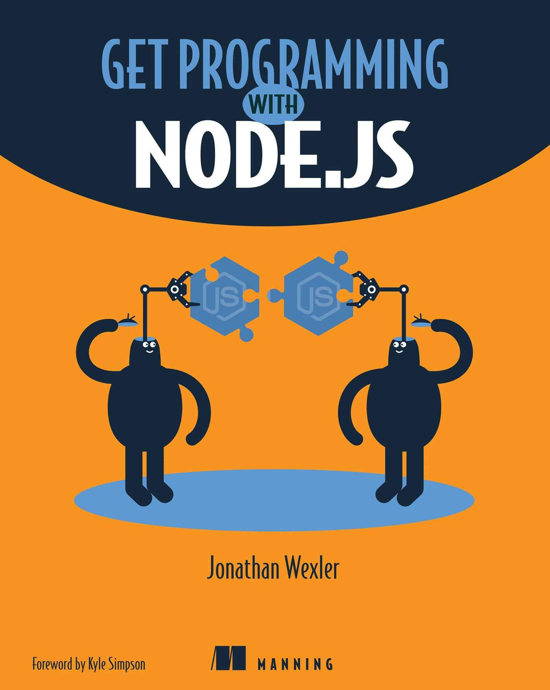

# Getting started with Express.js

This repo is just to keep track as I work through unit 2 of [Get Programming With Node.js](https://amzn.eu/d/1SdEKQ3) by Jonathan Wexler, which introduces the Express framework as an abstraction over route handling in Node.js.

### Lesson 8

- I learned how to set up a minimal Express server and serve a simple GET request.
- Nodemon was introduced as a tool to ease the development cycle by automatically restarting the server any time a file is changed.
- The purpose of the "scripts" section the `package.json` was clarified.

### Lesson 9

- [in progress]